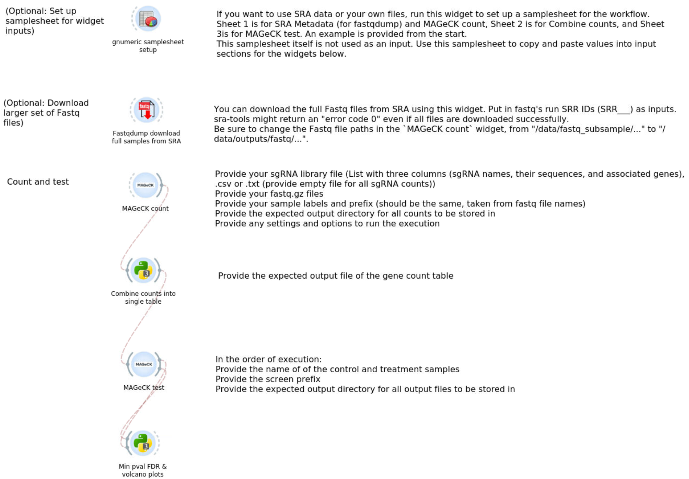

# gRNA-Enrichment

## Overview

This repository contains a [Biodepot-workflow-builder (Bwb)](https://github.com/BioDepot/BioDepot-workflow-builder) workflow to run `MAGeCK count` and a Jupyter Notebook for comparing the outputs of gene count table between samples from MSK (original data providers) and Bwb (reprocessed from the workflow). After obtaining counts, `MAGeCK test` executes gene rankings for provided screens. The final step takes `MAGeCK test` gene ranking outputs for each screen and get their minimum p-values and minimum FDR values, as well as create volcano plots from these minimum values.

## Workflow

**MAGeCK Count**: This step involves running the MAGeCK count tool (version 0.5.9.5) to quantify gRNA abundance from sequencing data. Main command is `mageck count`. Inputs are fastq files, outputs are gene count tables for each fastq file.

**Combine counts**: Combine counts obtained from `mageck count` into a single count table. Gene counts are summed based on their sample, if multiple fastq files are used for each sample. Summary statistics from `mageck count`, originally from each fastq file, are summarized for each sample.

**MAGeCK test**: Use the count table to get sgRNA and gene rankings.

**Minimum p-value FDR and volcano plots**: Take `mageck test` gene ranking outputs for each screen/prefix and extract the minimum p-values and minimum FDR values. Outputs are sorted and exported to separate text files. Includes the option to create plotly volcano plots from minimum p-values & FDR outputs for each screen/prefix.

## Included test data

This repository has publicly-available The included data is from the following study:

Rosen BP, Li QV, Cho HS, Liu D et al. Parallel genome-scale CRISPR-Cas9 screens uncouple human pluripotent stem cell identity versus fitness. Nat Commun 2024 Oct 17;15(1):8966. PMID: [39419994](https://www.ncbi.nlm.nih.gov/pubmed/39419994)

[NCBI GEO public access is located here.](https://www.ncbi.nlm.nih.gov/geo/query/acc.cgi?acc=GSE277069)

The workflow uses 1_E8_T0, 2_NE_GFP_high, 3_NE_GFP_low, and 7_E8_control samples (4 of the original 8) as workflow test samples. Downsampled versions of their fastq files are included in this repository for fast test purposes.

## Requirements

- Bwb
- Python 3.x
    - Pandas
    - NumPy
- Docker

## References

This repository uses MAGeCK, a tool created by Li, et al.

Li, W., Xu, H., Xiao, T. et al. MAGeCK enables robust identification of essential genes from genome-scale CRISPR/Cas9 knockout screens. Genome Biol 15, 554 (2014). https://doi.org/10.1186/s13059-014-0554-4

- Installation can be found on [SOURCEFORGE](https://sourceforge.net/projects/mageck/)
- Source code can be found on [Bitbucket](https://bitbucket.org/liulab/mageck/src/master/)

## Acknowledgments

- MorPhiC MSK team for providing the original data and processing scripts.
- Contributors to the MAGeCK tool.
